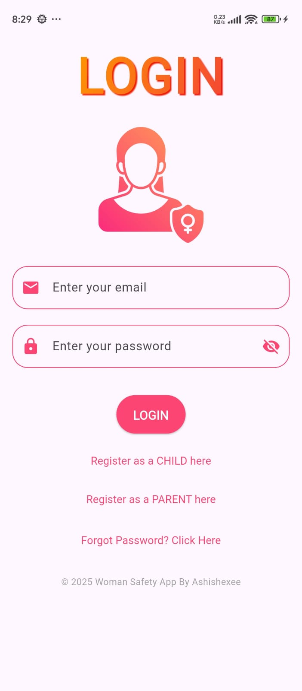
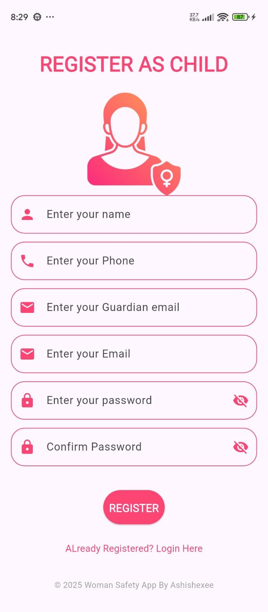
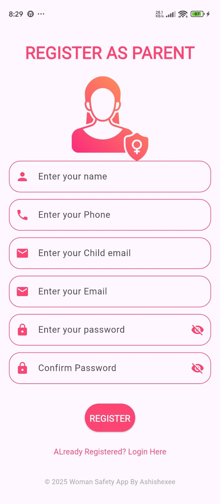
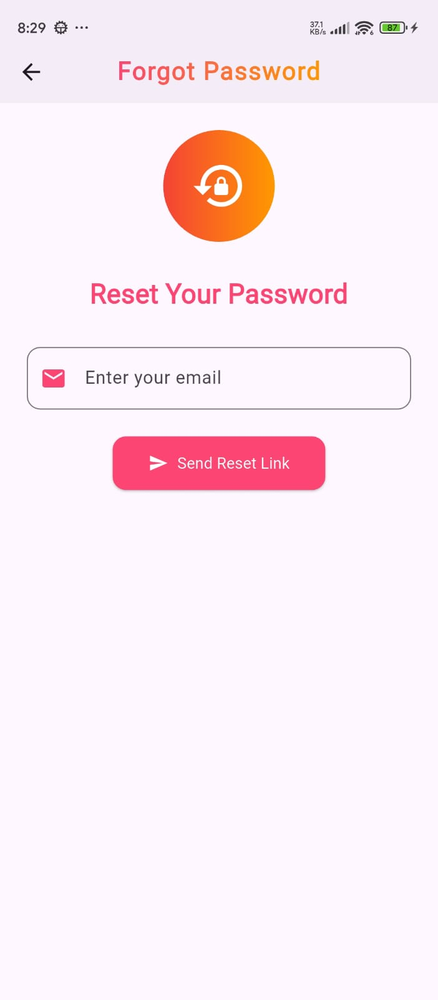
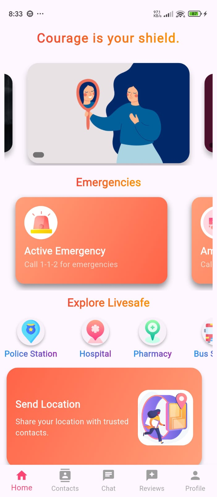
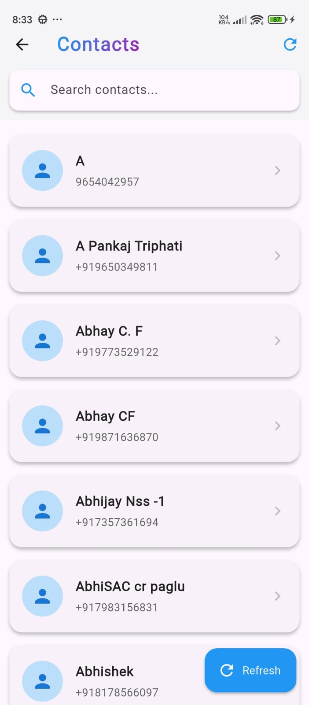
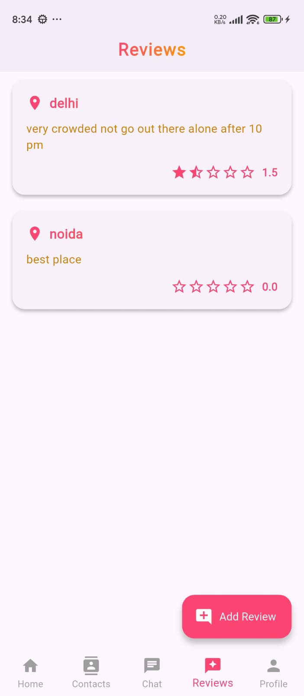
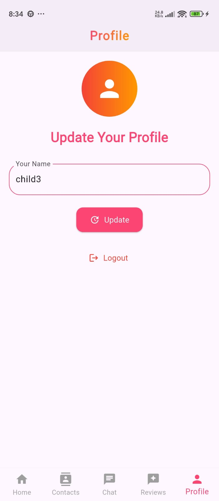

# Woman Safety App

A comprehensive Flutter application designed to enhance personal safety, provide emergency support, and facilitate communication between users and their trusted contacts. This app leverages real-time location tracking, emergency SMS, chat modules, and parental monitoring features to ensure user safety and peace of mind.

---

## Table of Contents

- [Features Overview](#features-overview)
- [Screens & Modules](#screens--modules)
  - [Authentication](#authentication)
    - [Login Screen](#login-screen)
    - [Register Screen](#register-screen)
    - [Forgot Password Screen](#forgot-password-screen)
  - [Child Module](#child-module)
    - [Child Home Screen](#child-home-screen)
    - [Chat Module](#chat-module)
      - [Chat Screen](#chat-screen)
      - [Message Text Field](#message-text-field)
    - [Profile Page](#profile-page)
    - [Emergency Features](#emergency-features)
      - [Shake Detection](#shake-detection)
      - [Location Tracking](#location-tracking)
      - [Emergency SMS](#emergency-sms)
    - [Contacts Management](#contacts-management)
  - [Parent Module](#parent-module)
    - [Parent Home Screen](#parent-home-screen)
    - [Child Monitoring](#child-monitoring)
    - [Chat with Child](#chat-with-child)
    - [Profile Page (Parent)](#profile-page-parent)
- [Background Services](#background-services)
- [Notifications](#notifications)
- [Permissions](#permissions)
- [How to Run](#how-to-run)
- [Screenshots](#screenshots)
- [Contributing](#contributing)
- [License](#license)

---
## Screenshots
 

---
## Features Overview

- **User Authentication:** Secure login, registration, and password reset.
- **Role-based Access:** Separate modules for child and parent users.
- **Real-time Chat:** Secure messaging between child and parent.
- **Emergency SOS:** Shake phone to send location and emergency SMS to trusted contacts.
- **Live Location Tracking:** Background location updates and sharing.
- **Contact Management:** Add, edit, and delete emergency contacts.
- **Profile Management:** Update user details and profile information.
- **Push Notifications:** Foreground service notifications for critical events.
- **Parental Monitoring:** Parents can view and communicate with their children.
- **Background Services:** Runs critical safety features even when the app is minimized.

---

## Screens & Modules

### Authentication

#### Login Screen

- **Features:**
  - Email and password login.
  - Role selection (Child/Parent).
  - Navigation to registration and forgot password screens.
- **Design:** Themed with app colors, modern input fields, and validation feedback.

#### Register Screen

- **Features:**
  - User registration with name, email, password, and role selection.
  - Stores user data in Firestore.
  - Input validation and error handling.
- **Design:** Consistent with login, includes password visibility toggle.

#### Forgot Password Screen

- **Features:**
  - Input email to receive a password reset link.
  - Feedback on success or failure.
- **Design:** Themed with gradient title, rounded input, and prominent action button.

---

### Child Module

#### Child Home Screen

- **Features:**
  - Dashboard with quick access to chat, contacts, profile, and emergency features.
  - Displays recent activity and status.
- **Design:** Card-based layout, icons for navigation, and status indicators.

#### Chat Module

##### Chat Screen

- **Features:**
  - Real-time messaging with parent or trusted contacts.
  - Messages are timestamped and show sender/receiver distinction.
  - Swipe to delete messages (removes from both sides).
  - Scrolls to latest message automatically.
- **Design:** Themed AppBar, message bubbles, and delete confirmation.

##### Message Text Field

- **Features:**
  - Input for sending text messages.
  - Option to send different message types (text, image, etc. if implemented).
  - Send button with feedback.

#### Profile Page

- **Features:**
  - View and update user name.
  - Logout functionality.
  - Themed avatar and gradient title.
- **Design:** Circular avatar, update button, and logout button.

#### Emergency Features

##### Shake Detection

- **Features:**
  - Detects phone shake using device sensors.
  - Triggers emergency protocol (vibration, notification, and SMS).
- **Design:** Runs in background, no UI but shows notification.

##### Location Tracking

- **Features:**
  - Continuously tracks and updates user location.
  - Shares location with parent and in emergency SMS.
- **Design:** Background service, notification with current location.

##### Emergency SMS

- **Features:**
  - Sends SMS with Google Maps location link to all saved contacts.
  - Toast feedback for success/failure.
- **Design:** No direct UI, triggered by shake or emergency button.

#### Contacts Management

- **Features:**
  - Add, edit, and delete trusted contacts.
  - Contacts stored locally or in Firestore.
  - Used for emergency SMS.
- **Design:** List view with add/edit/delete actions.

---

### Parent Module

#### Parent Home Screen

- **Features:**
  - Dashboard listing all linked children.
  - Quick access to chat and monitoring features.
- **Design:** List of children with status, chat icon, and phone number.

#### Child Monitoring

- **Features:**
  - View real-time location of child.
  - Receive notifications on emergency events.
- **Design:** Map view or list of recent locations (if implemented).

#### Chat with Child

- **Features:**
  - Real-time chat with child.
  - Same features as child chat screen.
- **Design:** Consistent with child chat UI.

#### Profile Page (Parent)

- **Features:**
  - View and update parent profile.
  - Logout functionality.
- **Design:** Same as child profile page.

---

## Background Services

- **Flutter Background Service:** Runs location tracking and shake detection even when app is minimized.
- **Foreground Notification:** Persistent notification to indicate active safety monitoring.

---

## Notifications

- **Local Notifications:** Used for location updates and emergency events.
- **Push Notifications:** (If implemented) for chat and critical alerts.

---

## Permissions

- **Location:** Required for tracking and sharing user location.
- **SMS:** Required for sending emergency messages.
- **Notification:** Required for foreground/background notifications.
- **Contacts:** (If implemented) for managing trusted contacts.

---